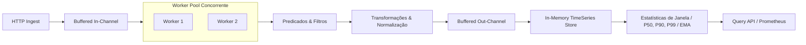

# Stream Data Pipeline

[](https://golang.org)
[](LICENSE)

Motor concorrente para ingestão de telemetria, agregação em janelas de tempo deslizantes e cálculo estatístico de métricas de Qualidade de Serviço (QoS) em Go.

Projetado para experimentação e estudos de arquitetura de processamento de fluxo contínuo de dados com baixa latência.

## Arquitetura



## Como Executar

```bash
make test
make test-bench
make run
```

## API Endpoints

| Método | Endpoint | Descrição |
|---|---|---|
| `POST` | `/api/v1/events` | Ingestão assíncrona de evento de telemetria |
| `GET` | `/api/v1/metrics` | Listagem de métricas registradas |
| `GET` | `/api/v1/metrics/query` | Consulta histórica com filtro temporal e tags |
| `GET` | `/api/v1/metrics/aggregate` | Agregação estatística de janela (Média, P50, P90, P99) |
| `GET` | `/health` | Healthcheck simples |
| `GET` | `/metrics` | Métricas operacionais em formato Prometheus |

## Autor

Silas Medeiros ([@silasms](https://github.com/silasms))  
silas.medeiros7@gmail.com
